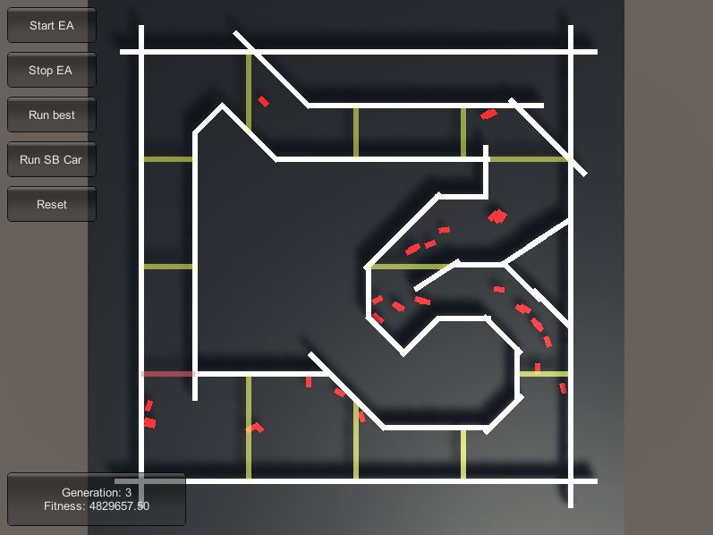

# DasSelbstfahrendeAuto
ML project for selfdriving car simulation based on UnityNEAT

## YouTube

## Installation
1. Copy UnityNEAT to Application.persistentDataPath
- Windows: C:\Users\<user>\AppData\LocalLow\DefaultCompany\
- other Platform: https://docs.unity3d.com/ScriptReference/Application-persistentDataPath.html
2. run exe

## Built With
* [UnityNEAT](https://github.com/lordjesus/UnityNEAT) - port of SharpNEAT
* [Unity](https://unity.com/) - real-time 3D development platform
